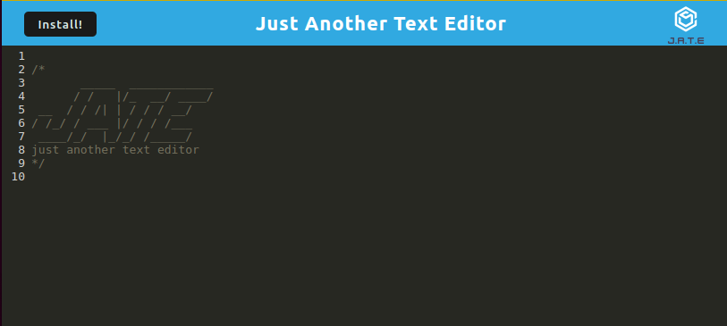
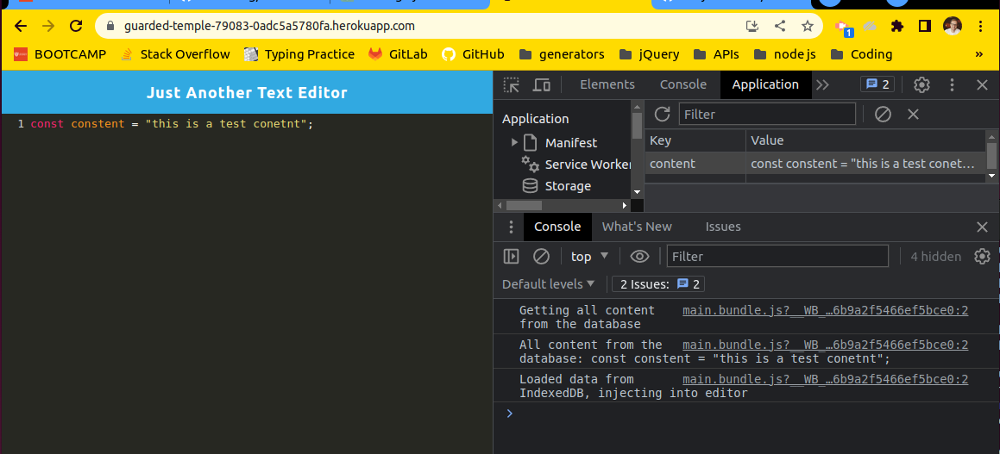
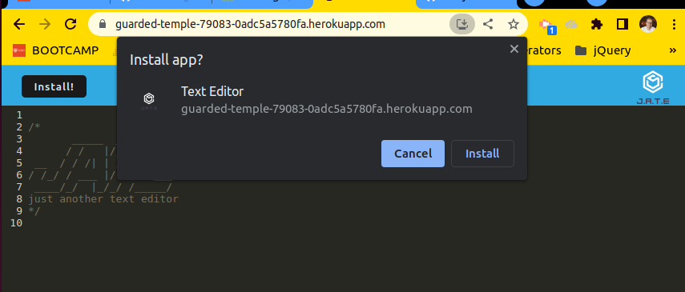

# Just Another Text Editor

## Description

Just Another Text Editor is an in-browser text editor application that allows you to create and manage notes or code snippets. It offers offline functionality and utilizes data persistence techniques to ensure reliability and accessibility of your content.

## Table of Contents

- [Usage](#usage)
- [Screenshots](#screenshots)
- [License](#license)
- [Contributing](#contributing)
- [Questions](#questions)
- [Credits](#credits)
- [Links](#links)

## Usage

To use Just Another Text Editor, follow these steps:

1. Open the application in your preferred web browser.
2. When you ope the page for the first time your editor will have a header in the text area, replace it with your content.

3. When you click off the DOM window it will get saved to your database.
4. When you refresh the page or close it and return to it later, it will retrieve the saved version of your content and you can keep editing it - it will get saved every time you click off your window.

5. There is an `Install` button on the left of the top bar. If you click it and confirm the installation, the text editor will get saved as an app on your desktop. You can use it both in an app window or in your browser.

6. Both installed app and in-browser version have the off-line functionality.

(<a href="#readme-top">back to top</a>)

## License

Distributed under the [MIT License](https://opensource.org/licenses/MIT). See LICENSE.txt for more information.

(<a href="#readme-top">back to top</a>)

## Contributing

If you have a suggestion that would make this better, please fork the repo and create a pull request. You can also simply open an issue with the tag "enhancement".
Don't forget to give the project a star!

1. Fork the Project
2. Create your Feature Branch (`git checkout -b feature/YourFeature`)
3. Commit your Changes (`git commit -m 'Add Your Feature'`)
4. Push to the Branch (`git push origin feature/YourFeature`)
5. Open a Pull Request

(<a href="#readme-top">back to top</a>)

## Questions

If you have any questions about the project please contact me through [my Github](https://github.com/voi-jankowski) or email me at [voi.jankowski@gmail.com](mailto:voi.jankowski@gmail.com).

(<a href="#readme-top">back to top</a>)

## Credits

The UI was created by edX Boot Camps LLC.

(<a href="#readme-top">back to top</a>)

## LInks

The location of the project [on GitHub](https://github.com/voi-jankowski/text-editor).

You can check out the live application [here](https://guarded-temple-79083-0adc5a5780fa.herokuapp.com/).

(<a href="#readme-top">back to top</a>)

